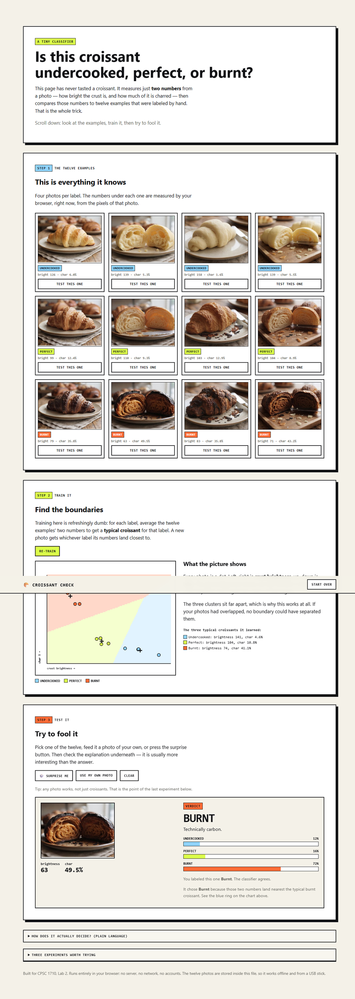

# CPSC 1710 — Lab 2: From One Pixel to Your Classifier

**Croissant Check** is a tiny classifier that looks at a photo of a croissant
and guesses whether it is undercooked, perfect, or burnt. It is built on top of
the provided One Pixel ML starter.

## What is here

| File | Purpose |
| --- | --- |
| `croissant-check.html` | **My classifier.** Open this one. |
| `one-pixel.html` | Provided starter page, unchanged, for comparison. |
| `images/dataset/` | The twelve labeled croissant photos. |
| `README.md` | This file: project notes, development log, and reflection. |

## How to open and use the page

No installation, no build step, no accounts, no internet connection.

1. Download or clone this repository.
2. **Double-click `croissant-check.html`.** It opens in Chrome, Edge, Safari, or
   Firefox. You can also drag the file onto a browser window.

Avoid VS Code's **Open Preview** — its internal `file+.vscode-resource` links do
not behave like normal browser addresses. Open the file in a real browser.

### How to test it

1. **Look at Step 1.** The twelve examples appear with the two numbers the
   browser just measured from each photo.
2. **Press "Train the classifier"** in Step 2. A chart appears showing every
   photo as a dot and the three coloured regions the classifier decided on.
3. **Test it** in Step 3, three ways:
   - Press **"Test this one"** under any of the twelve photos.
   - Press **🎲 Surprise me** for a random one.
   - Press **"Use my own photo"** and pick any image file on your computer.
4. Watch the **blue ring** appear on the chart — that is where your photo landed.
5. **"Clear"** removes the result; **"Start over"** resets the whole page.

Three experiments worth running, which the page also lists at the bottom:

| Kind of case | What to do | What happens |
| --- | --- | --- |
| Easy | Test any of the twelve photos | Confident and correct — it has seen that photo |
| Close call | Test `perfect-2` (the palest perfect one) | Still right, but confidence drops |
| Strange | Upload something that is not a croissant | It answers confidently anyway — see the limitation below |

The whole page is one file. The twelve photos are stored inside it, so it works
offline, from a USB stick, or emailed to someone.

## My classifier

**Croissant Check** — a tiny classifier that looks at a photo of a croissant
and guesses whether it came out undercooked, perfect, or burnt.

### The idea (Stop 3)

1. **My page will classify** photographs of croissants by how well they were
   baked.
2. **The possible labels are** Undercooked, Perfect, and Burnt.
3. **The classifier will look at** two numbers measured from the photo itself:
   - **Crust brightness** — how light or dark the croissant is on average
   - **Char** — the percentage of pixels dark enough to count as burnt
4. **One example it can learn from is** `perfect-2.jpg`, which has brightness
   111 and 9% char, and which I label *Perfect*. Compare `undercooked-3.jpg` at
   brightness 159 with almost no char (1.7%), which I label *Undercooked*.
5. **A visitor should understand that** the page is not recognising a croissant.
   It only measures two colour numbers and compares them to the twelve examples
   I labeled, so a dark photo of almost anything would come back *Burnt*. The
   boundaries reflect my opinions about baking, not a rule of pastry, and photos
   near a boundary are close calls where the page is least trustworthy.

This is the same shape as One Pixel ML — twelve labeled examples, and a
brightness number — just with a real photo instead of a single pixel, a second
measurement alongside brightness, and three labels instead of two.

The labels are in order, which makes mistakes easy to talk about: calling an
Undercooked croissant *Perfect* is a near miss, while calling it *Burnt* is a
real failure.

### The twelve examples

Four photos per label, in [`images/dataset/`](images/dataset/), split out of the
three grids I generated. Measured values:

| Label | Crust brightness | Char |
| --- | --- | --- |
| Undercooked | 127 – 159 | 1.7% – 6.2% |
| Perfect | 100 – 111 | 9.2% – 13.2% |
| Burnt | 64 – 84 | 36.2% – 50.3% |

The three groups do not overlap on either measurement, so even a simple
boundary should separate them. Brightness alone nearly does the whole job; char
is what makes *Burnt* unmistakable.

### How it makes a prediction (in plain language)

1. **Measure.** The photo is shrunk to a small grid and the middle of it — where
   the croissant sits — is scanned pixel by pixel. Two numbers come out: the
   average brightness of those pixels, and the percentage of them that are very
   dark, which the page calls *char*.
2. **Learn.** Each of the twelve labeled photos gives a pair of numbers.
   Averaging the four photos in a label gives one "typical" croissant for that
   label — three points in total:

   | Label | Typical brightness | Typical char |
   | --- | --- | --- |
   | Undercooked | 141 | 4.6% |
   | Perfect | 104 | 10.8% |
   | Burnt | 74 | 41.1% |

3. **Decide.** A new photo is measured the same way and gets whichever of those
   three typical points it lands nearest. The confidence bars are just how much
   nearer the winner was than the other two.

On the twelve training photos it gets **12 out of 12** right, which sounds
impressive until you remember it has seen all twelve.

### One limitation I found

The page never learns what a croissant *is*. Feeding it a plain grey rectangle —
no croissant anywhere — returns **Perfect** with high confidence. A plain dark
rectangle returns **Burnt**, and a white one returns **Undercooked**. Shape,
layers, and crumb are completely invisible to it; it only ever sees two numbers
about colour. It also has no way to say "I don't know," so it always commits to
one of the three labels no matter what you show it.

## Development log

Moments where I directed the work, in order:

1. I started with a cookie idea and switched it to croissants, because the
   failure modes I actually care about are dryness and crustiness.
2. I noticed that "too fluffy" and "not crusty enough" were describing the same
   thing, so I collapsed four labels into three: undercooked, perfect, burnt.
   That also let me drop butter as an input, since butter does not change
   whether something is cooked.
3. I generated twelve photos myself — four per label — instead of using sliders
   for oven temperature and time. That changed the project: the classifier now
   measures real pixels from a photo rather than reading numbers I typed.
4. _(add your own here as you keep working)_

## Reflection

_Written by me, without AI assistance, at the end of the lab._

## Credits

The `one-pixel.html` starter page is by
[Xiuye Chen](https://github.com/xiuyechen), from the
[CPSC 1710 labs](https://xiuyechen.github.io/cpsc1710-labs/), and is shared
under [CC BY 4.0](https://creativecommons.org/licenses/by/4.0/). My additions to
this repository are coursework for CPSC 1710, Fall 2026.
